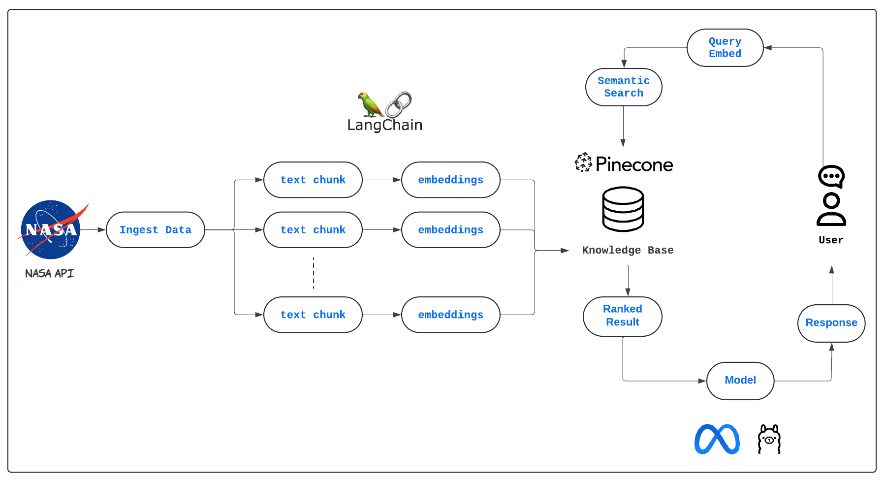

# NASA Chatbot 

---
## Description

This project is a `Retrieval-Augmented Generation (RAG)` chatbot built using the `Llama 2` model. The chatbot leverages NASA API data to provide users with detailed, accurate, and up-to-date information on various space-related topics. 
By utilizing `LangChain`, the chatbot efficiently manages conversation flow and integrates multiple data sources, while `Pinecone` enables fast and scalable vector-based search for relevant information. 
This repository contains all necessary code and documentation to deploy the RAG chatbot and interact with NASA's vast data through an intuitive conversational interface.
### Architecture Diagram

### Demo
 

## Instructions
Follow these instructions to successfully run the script:

1. Add the environment variables in the `.env` file. The following variables are required:
- `HUGGINGFACE_TOKEN`
- `PINECONE_API_KEY`
- `PINECONE_ENV`
- `PINECONE_INDEX` 
- `NASA_API_KEY` 
- `NASA_URL` 

2. Now activate a virtual environment using these commands:
 
- `cd nasa-chatbot`
- `conda create -n nasa_chatbot python=3.9 -y`
- `conda activate nasa_chatbot`
- `python setup.py`

3. Load the requirements by using the following command:

- `pip install -r requirements.txt`

4. Now execute `python index.py` 

5. Finally run `app.py` to launch the chatbot application.

Note: Please download and place the model in the `model` folder before running the project.
